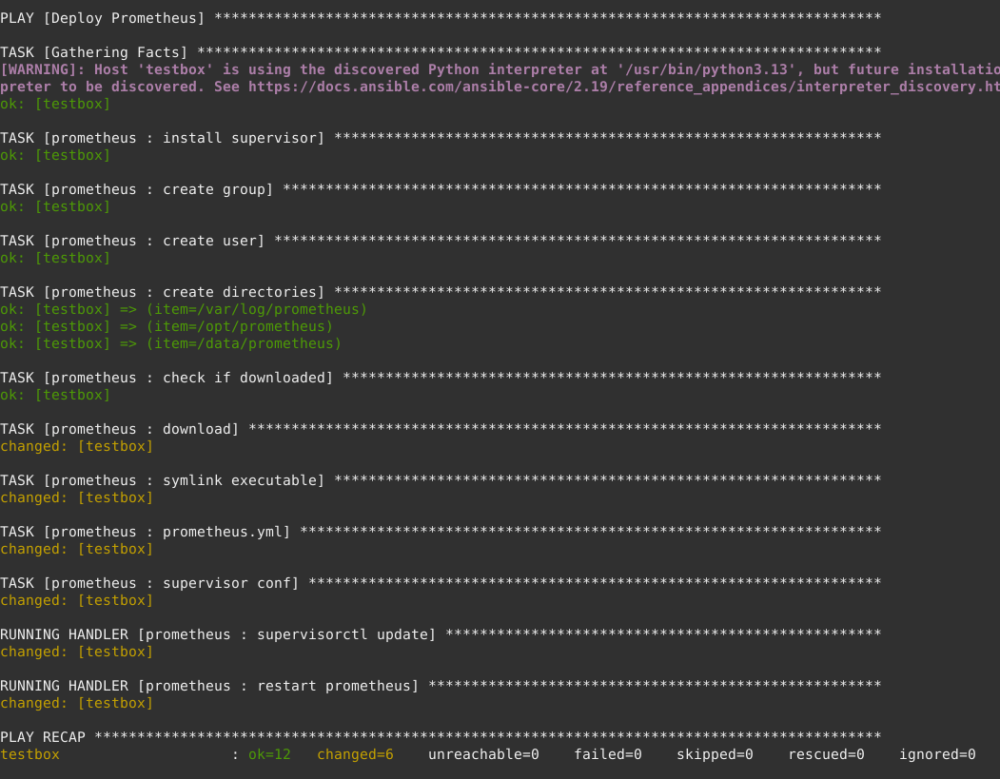

# URL
http://35.228.232.172


# Decisions


## Flask

Why Flask ?

Micro python webframework,
no steep learning curve and serves
the purpose of this task, as well as,
many enterprises.

Also, a long-long time ago, a savant
techie friend of mine told me about
it, in response to me talking about 
using Django for a simple project.

Django was definitely an overkill
on the baseline resource level.

His remark still stands true today.

Flask does not aim to offer every
function a monolithic webframework
may, rather it does the "web" part
of the webframework exceptionally
well.


## GCP / GKE

Why GoocleCloudPlatform?

Earlier this week I started my journey with GCP.

I find it to be a great time to familiarize myself with GCP.
GCP has been picking up more of the cloud platform market share,
growing exponentially in the past 5 years.

I was shocked to find out, how frequently the default auto-upgrade
schedule upgrades the GKE nodes. Must be for security reasons, 
which are great reasons. 

>And there I was thinking nothing is more bleeding edge, than ArchLinux - I'm out-of-date :)


Technical how-to on my setup in GCP:

https://github.com/voltwinbolt-oss/gcp-gke-test


## Terraform 
(IaC for gcp-micro-instance)

Why Terraform?

I have used it before, and find it a great framework
with a vast support for a multitude of providers, from cloud to libvirt

Predisposed for templating by external tools, like salt or ansible for large infrastructure maps.

Also, akin to Flask it focuses on one thing IaC, hence it's a solid and battle tested frameork way.


## Ansible

Why Ansible ?

Ansible is very ~~pervasive~~ resilient, in a sense, that AWS adopted it for playbooks,
therefore it's, as solid, as ever of configuration framework and IaC now too.


## Prometheus

>Note (humorous):

If the /metrics requests counters turn into a run away train,

I promise it is not the Prometheus Counter logic, it's the Mirai's successor IoT B0tnet

Confirmed on localhost, counters don't change without refreshes over cputime lightyears.


Deployed via playbook on GCP instance successfully



```
curl -s http://localhost:9090/api/v1/targets | jq
{
  "status": "success",
  "data": {
    "activeTargets": [
      {
        "discoveredLabels": {
          "__address__": "35.228.232.172",
          "__metrics_path__": "/metrics",
          "__scheme__": "http",
          "__scrape_interval__": "5s",
          "__scrape_timeout__": "5s",
          "app": "adco",
          "job": "adco"
        },
        "labels": {
          "app": "adco",
          "instance": "35.228.232.172",
          "job": "adco"
        },
        "scrapePool": "adco",
        "scrapeUrl": "http://35.228.232.172/metrics",
        "globalUrl": "http://35.228.232.172/metrics",
        "lastError": "",
        "lastScrape": "2025-10-17T02:02:44.705637137Z",
        "lastScrapeDuration": 0.007810373,
        "health": "up",
        "scrapeInterval": "5s",
        "scrapeTimeout": "5s"
      }
    ],
    "droppedTargets": [],
    "droppedTargetCounts": {
      "adco": 0
    }
  }
}
```

## Site (tree)
http://35.228.232.172

```
/gandalf
└── Gandalf's picture 

/colombo
└── Colombo's current time

/metrics
├── gandalf_requests_total
└── colombo_requests_total
```


## References

https://flask.palletsprojects.com/en/stable/quickstart/#a-minimal-application

https://docs.python.org/3.9/library/zoneinfo.html

https://prometheus.github.io/client_python/

https://prometheus.github.io/client_python/exporting/http/flask/

https://prometheus.github.io/client_python/instrumenting/counter/